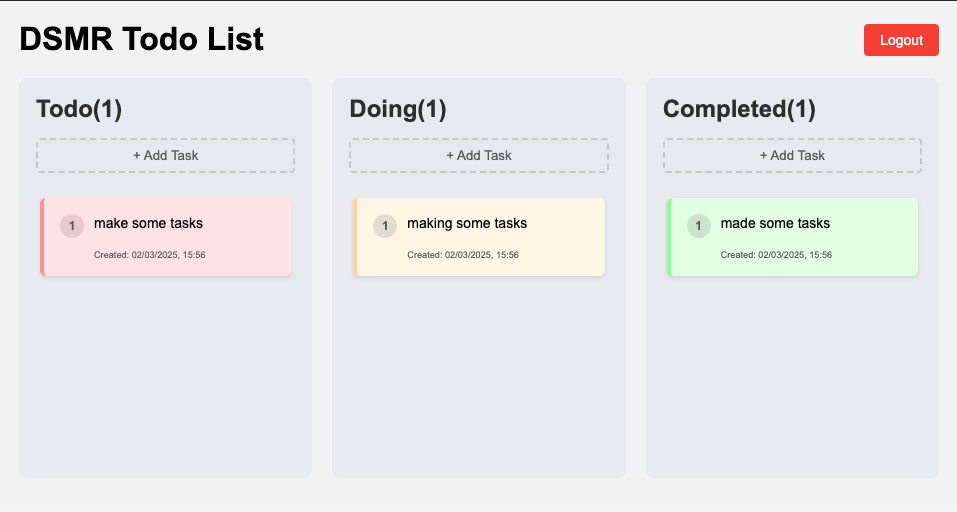

# DSMR Todo List

A simple, responsive Kanban-style task management application built with vanilla JavaScript and Supabase for data storage.



## Features

- **Kanban Board Layout**: Organize tasks in three columns - Todo, Doing, and Completed
- **Drag and Drop**: Intuitive drag and drop functionality for both desktop and mobile devices
- **Task Management**: Create, edit, and delete tasks easily
- **Responsive Design**: Works well on both desktop and mobile devices
- **Authentication**: Simple password protection for the application
- **Persistent Storage**: All tasks are stored in Supabase database

## Technical Stack

- **Frontend**: Vanilla JavaScript, HTML, CSS
- **Backend**: Supabase (PostgreSQL database with REST API)
- **Build Tool**: Vite
- **Authentication**: Simple password-based authentication

## Project Structure

- `main.js`: Core functionality for task management and UI interactions
- `auth.js`: Authentication logic
- `config.js`: Supabase configuration
- `index.html`: Main application layout and styles
- `package.json`: Project dependencies and scripts

## Setup Instructions

1. Clone the repository
2. Install dependencies:
   ```
   npm install
   ```
3. Create a `.env` file with the following variables:
   ```
   SUPABASE_URL=your_supabase_url
   SUPABASE_ANON_KEY=your_supabase_anon_key
   VITE_APP_PASSWORD=your_app_password
   ```
4. Run the development server:
   ```
   npm run dev
   ```

## Database Structure

The application uses a Supabase table called `tasks` with the following structure:

- `id`: UUID (primary key)
- `content`: Text (task description)
- `status`: Text (todo, doing, or completed)
- `created_at`: Timestamp
- `completed_at`: Timestamp (nullable)
- `position`: Integer (for ordering tasks within columns)

## Usage

1. Enter the password to access the application
2. Add tasks to any column using the "+ Add Task" button
3. Drag and drop tasks between columns to change their status
4. Click on a task to edit its content
5. Use the delete button to remove tasks
6. Use the "Move Back" button to move completed tasks back to the Todo column

## Mobile Support

The application includes special handling for touch events to enable drag and drop functionality on mobile devices, with visual feedback during dragging operations.

## License

ISC
